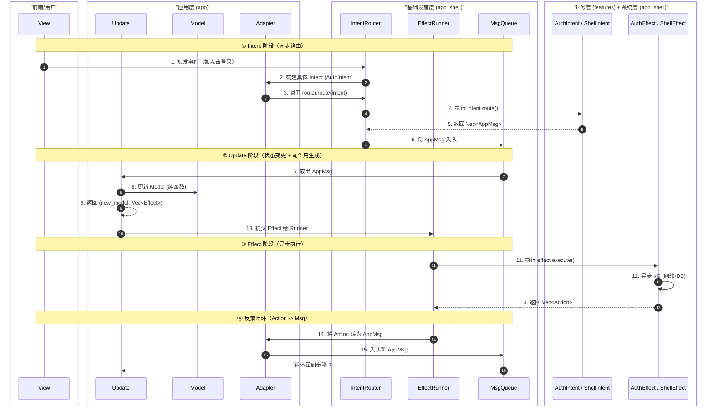

# TEA 架构依赖方向与数据流原则

**版本**: 1.0
**状态**: 稳定
**创建日期**: 2026-08-03
**关联文档**:

- [Msg-Intent-Effect-设计指南.md](./Msg-Intent-Effect-设计指南.md)
- [25-tea-feature-inventory.md](./25-tea-feature-inventory.md)
- [26-tea-naming-convention.md](./26-tea-naming-convention.md)

***

## 一、核心理念

`features`、`app` 和 `app_shell` 的调用关系必须从**两个维度**理解：**编译时**（物理依赖）和**运行时**（逻辑数据流）。它们的方向**完全不同**——这是依赖倒置原则（DIP）在 TEA 架构中的具体体现，也是实现解耦的精髓所在。

| 维度          | 方向   | 核心原则                  |
| ----------- | ---- | --------------------- |
| 编译时（use 关系） | 自上而下 | 上层依赖下层的**抽象**，下层不依赖上层 |
| 运行时（控制流）    | 自下而上 | 上层协调下层，下层产生数据回流       |

***

## 二、编译时依赖（物理模块关系）

这是 Rust 模块系统层面的依赖图，遵循**稳定依赖原则**——底层模块不能知道上层模块的存在。

### 2.1 依赖方向图

```
                   ┌─────────────┐
                   │    app      │  (应用入口 / 组合根)
                   └──────┬──────┘
                          │ 依赖
           ┌──────────────┼───────────────┐
           ▼              ▼               ▼
    ┌───────────┐  ┌───────────┐   ┌───────────┐
    │ features/ │  │ features/ │   │ features/ │
    │  header   │  │ explorer  │   │   ...     │  (业务实现)
    └─────┬─────┘  └─────┬─────┘   └─────┬─────┘
          │              │               │
          └──────────────┼───────────────┘
                         │ 依赖（抽象契约）
                         ▼
              ┌─────────────────────┐
              │     app_shell       │  (基础设施 / 抽象特征)
              └─────────────────────┘
```

### 2.2 模块可见性规则

| 模块          | 可以 `use` 谁？                                                                                  | 被谁 `use`？               |
| ----------- | -------------------------------------------------------------------------------------------- | ----------------------- |
| `app_shell` | 标准库、第三方库。**不能 use** **`app`** **或** **`features`**                                           | 被 `app` 和 `features` 依赖 |
| `features`  | 可以 use `app_shell`（使用 `Effect`/`Intent` trait、`ShellAction`/`ShellMsg`）。**不能 use** **`app`** | 被 `app` 依赖              |
| `app`       | 可以 use `app_shell` 和所有 `features`                                                            | 不被任何模块依赖，是顶层入口          |

### 2.3 `app_shell` 内部零业务依赖验证

`app_shell` 层的所有文件**不得**出现以下模式：

```rust
// ❌ 禁止：app_shell 直接引用 features
use crate::features::header::msg::HeaderMsg;

// ❌ 禁止：app_shell 直接引用 app 层
use crate::app::msg::AppMsg;
```

`app_shell` 只能定义和使用自己的类型：

- `ShellMsg`（系统消息：Quit、Tick、FocusChanged）
- `ShellAction`（系统动作：Quit、Noop）
- `Effect` trait、`Intent` trait（抽象契约）
- `EffectRunner`、`IntentRouter`（工具/执行器）

***

## 三、运行时数据流（逻辑执行顺序）

这是程序实际的执行顺序，遵循 TEA **单向数据流**模式。

### 3.1 数据流全景

```
用户输入 / 异步结果
        │
        ▼
   AppMsg（全局聚合消息）
        │
        ▼
   app_shell::update(state, msg)
        │
        ├──► 各 Feature 的 update(msg) → (State, Vec<Intent>, Vec<Effect>)
        │
        ├──► IntentRouter 处理 Intent → 返回 AppMsg 入队
        │
        └──► EffectRunner 执行 Effect → 异步完成后产生 Action → 转为 AppMsg 入队
                │
                └──► 新 AppMsg 重新进入 update 循环
```

### 3.2 运行时角色

| 模块          | 运行时职责                                                                            |
| ----------- | -------------------------------------------------------------------------------- |
| `app`       | 实例化 `EffectRunner`、`IntentRouter`；将 `ShellMsg` 转换为 `AppMsg`；构造具体业务 Intent/Effect |
| `app_shell` | 持有 `ShellState`；调度 Feature 的 `update()`；路由 Intent；执行 Effect                      |
| `features`  | 接收 Msg → 更新 State → 产生 Intent/Effect；**不直接调用任何外部模块**                             |

### 3.3 Effect 执行数据流

```
Feature.update()
    │  返回 Vec<FeatureEffect>
    ▼
app_shell::update() 收集 Effect
    │  调用 effect_runner.submit(...)
    ▼
EffectRunner（异步执行）
    │  tokio::spawn 执行 Effect::execute()
    │  Effect 返回 Vec<FeatureAction>
    │  通过 From<FeatureAction> for Action 转为 Action
    │  Action::Dispatch(AppMsg) → 通道发送
    │  Action::Shell(ShellAction) → 通道发送
    ▼
主循环接收 Action
    │  Dispatch(msg) → 直接 dispatch_msg(state, msg)
    │  Shell(shell_action) → convert_shell_action() → 转为 AppMsg → dispatch_msg()
    ▼
新 AppMsg 进入 update 循环
```

***

## 四、运行时完整时序图

以下 Mermaid 时序图展示了从用户交互到最终反馈闭环的完整运行时数据流，涵盖四个阶段：**Intent（同步路由）→ Update（状态变更）→ Effect（异步执行）→ Feedback（反馈闭环）**。



### 时序说明

| 阶段         | 步骤    | 类型 | 职责方                          | 关键产出                       |
| ---------- | ----- | -- | ---------------------------- | -------------------------- |
| ① Intent   | 1-6   | 同步 | IntentRouter + AuthIntent    | `Vec<AppMsg>`              |
| ② Update   | 7-10  | 同步 | app\_shell::update + Feature | `(new_model, Vec<Effect>)` |
| ③ Effect   | 11-13 | 异步 | EffectRunner + AuthEffect    | `Vec<Action>`              |
| ④ Feedback | 14-15 | 同步 | EffectRunner + Adapter       | 新 `AppMsg` 入队              |

**关键设计点**：

- Intent 阶段全程同步，无 I/O，确保路由逻辑可预测
- Update 阶段全程同步纯函数，不执行任何副作用
- Effect 阶段异步执行，所有 I/O 隔离在 `tokio::spawn` 中
- Feedback 阶段通过 `Action` 适配器自动转换，无需手动桥接
- 四个阶段形成闭环，循环直到无新消息入队

***

## 五、关键交互"桥梁"

在代码层面，`app` 层是连接 `app_shell` 和 `features` 的核心桥梁。

### 桥梁 A：类型聚合（`app/msg.rs`）

`app` 将系统类型（`ShellMsg`）和业务类型（`FeatureMsg`）聚合为统一的应用类型（`AppMsg`）：

```rust
// app/msg.rs
pub enum AppMsg {
    Shell(ShellMsg),
    Header(HeaderMsg),
    Discover(DiscoverMsg),
    Explorer(ExplorerMsg),
    Iw(IwMsg),
    Sql(SqlMsg),
    Noop,
}

impl From<ShellMsg> for AppMsg {
    fn from(msg: ShellMsg) -> Self {
        AppMsg::Shell(msg)
    }
}
```

### 桥梁 B：Action 汇聚（`app_shell/action/mod.rs`）

`Action` 是 Effect 执行结果的统一出口，`ShellAction` 作为系统级动作：

```rust
// app_shell/action/mod.rs
pub enum Action {
    Dispatch(crate::app::msg::AppMsg),  // 业务消息 → 重新入队
    Shell(ShellAction),                  // 系统动作 → 转换为 ShellMsg
}

pub enum ShellAction {
    Quit,
    Noop,
}
```

`ShellAction` 转换为 `AppMsg` 在 `app_shell/run.rs` 中完成（适配逻辑）：

```rust
// app_shell/run.rs
fn convert_shell_action(action: ShellAction) -> Option<AppMsg> {
    match action {
        ShellAction::Quit => Some(AppMsg::Shell(ShellMsg::Quit)),
        ShellAction::Noop => None,
    }
}
```

### 桥梁 C：Effect 提交与结果回传

Feature 的 Effect 通过 `From` 转换自动适配为 `Action`：

```rust
// features/explorer/effect.rs
impl From<ExplorerAction> for Action {
    fn from(action: ExplorerAction) -> Self {
        Action::Dispatch(AppMsg::Explorer(match action { ... }))
    }
}
```

Shell 的 Effect 返回 `ShellAction`，通过 `Into<Action>` 自动被 `EffectRunner` 接收：

```rust
// app_shell/effect/effect.rs
impl Effect for ShellEffect {
    type Action = ShellAction;
    fn execute(self: Box<Self>) -> Pin<Box<dyn Future<Output = Vec<ShellAction>> + Send>> { ... }
}
// ShellAction: Into<Action> 由通用实现覆盖
```

***

## 六、各层类型定义与使用规范

### 6.1 `app_shell` 层

| 类型               | 定义位置                               | 职责                                              |
| ---------------- | ---------------------------------- | ----------------------------------------------- |
| `ShellMsg`       | `app_shell/msg.rs`                 | 系统级消息（Quit、Tick、FocusChanged）                   |
| `ShellAction`    | `app_shell/action/mod.rs`          | 系统级动作（Quit、Noop）                                |
| `Effect` trait   | `app_shell/effect/effect_trait.rs` | 副作用契约（关联 `type Action`）                         |
| `Intent` trait   | `app_shell/intent/intent_trait.rs` | 意图契约（关联 `type Message`）                         |
| `BoxedEffect`    | `app_shell/effect/runner.rs`       | 类型擦除的 Effect 包装（`Effect::Action: Into<Action>`） |
| `BoxedIntent<M>` | `app_shell/intent/router.rs`       | 类型擦除的 Intent 包装（`Intent::Message: Into<M>`）     |
| `ShellEffect`    | `app_shell/effect/effect.rs`       | 系统级 Effect（Quit、Noop）                           |
| `ShellIntent`    | `app_shell/intent/intent.rs`       | 系统级 Intent（Quit）                                |

### 6.2 `app` 层

| 类型                          | 定义位置         | 职责                                                |
| --------------------------- | ------------ | ------------------------------------------------- |
| `AppMsg`                    | `app/msg.rs` | 全局聚合消息（`Shell(ShellMsg)` + 各 FeatureMsg + `Noop`） |
| `From<ShellMsg> for AppMsg` | `app/msg.rs` | 系统消息到应用消息的适配转换                                    |

### 6.3 `features` 层

| 类型              | 定义位置                        | 职责                                            |
| --------------- | --------------------------- | --------------------------------------------- |
| `FeatureMsg`    | `features/{name}/msg.rs`    | Feature 内部消息                                  |
| `FeatureIntent` | `features/{name}/intent.rs` | 跨 Feature 意图（实现 `Intent` trait）               |
| `FeatureEffect` | `features/{name}/effect.rs` | 异步副作用（实现 `Effect` trait）                      |
| `FeatureAction` | `features/{name}/effect.rs` | Effect 执行结果（`From<FeatureAction> for Action`） |

***

## 七、谁"调用"谁？

| 调用方向                      | 具体体现                                                                                  |
| ------------------------- | ------------------------------------------------------------------------------------- |
| **app → features**        | `app` 通过 `AppMsg` 构造器引用具体 Feature 的 Msg（如 `AppMsg::Discover(DiscoverMsg::OpenModal)`） |
| **app → app\_shell**      | `app` 实例化 `EffectRunner` 和 `IntentRouter`，调用 `submit()` 和 `route()` 方法                |
| **features → app\_shell** | Feature 实现 `Effect`/`Intent` trait，依赖 `ShellAction`/`ShellMsg` 等系统原语                  |
| **app\_shell → features** | **绝不直接调用**。`app_shell` 通过泛型参数 `E: Effect` 或 `I: Intent` 与具体类型交互                       |
| **app\_shell → app**      | **绝不直接调用**。`app_shell` 不引用 `AppMsg`，所有消息通过 `Action` 通道回流，由 `app_shell/run.rs` 的主循环处理  |

***

## 八、黄金法则清单

### 8.1 编译时检查（物理依赖方向）

- [ ] `app_shell` 中无 `use crate::features::*`
- [ ] `app_shell` 中无 `use crate::app::*`
- [ ] `features` 中无 `use crate::app::*`
- [ ] `features` 中只 `use crate::app_shell::*`（Effect/Intent trait、ShellAction/ShellMsg）
- [ ] `app` 是唯一同时依赖 `app_shell` 和 `features` 的模块（组合根）

### 8.2 运行时检查（逻辑数据流方向）

- [ ] Feature 的 `update()` 不直接调用外部服务，只返回 Intent/Effect
- [ ] 所有 Effect 通过 `EffectRunner` 执行，结果通过 `Action` 通道回流
- [ ] 所有 Intent 通过 `IntentRouter` 路由，不直接跨 Feature 调用
- [ ] `ShellEffect` 返回 `ShellAction`，在 `run.rs` 中转换为 `ShellMsg`
- [ ] Feature Effect 的 `From<Action>` 转换在 feature 自身的 `effect.rs` 中定义
- [ ] Feature Intent 的 `Intent::route()` 返回 `AppMsg`，由 `BoxedIntent` 适配

### 类型安全检查

- [ ] `Effect` trait 的 `type Action` 不硬编码具体业务类型
- [ ] `Intent` trait 的 `type Message` 不硬编码具体业务类型
- [ ] `BoxedEffect` 要求 `E::Action: Into<Action>`（统一出口）
- [ ] `BoxedIntent<M>` 要求 `I::Message: Into<M>`（统一出口）

***

## 八、架构类比

| 组件          | 类比            | 职责                                                            |
| ----------- | ------------- | ------------------------------------------------------------- |
| `app_shell` | 操作系统内核        | 定义抽象契约（Effect/Intent trait）、提供基础设施（EffectRunner、IntentRouter） |
| `features`  | 驱动程序          | 实现内核定义的契约（Effect、Intent），管理各自的领域状态                            |
| `app`       | 设备管理器 / 主程序入口 | 聚合各模块类型，注入依赖，协调初始化                                            |

**内核不知道驱动，管理器负责插拔和调度。**

***

## 九、文件组织参考

```
dbm-tui/src/
├── app/                              # 应用层（组合根）
│   └── msg.rs                        # AppMsg + From<ShellMsg> 转换
├── app_shell/                        # 壳层（基础设施）
│   ├── msg.rs                        # ShellMsg
│   ├── action/
│   │   └── mod.rs                    # Action + ShellAction
│   ├── effect/
│   │   ├── effect_trait.rs           # Effect trait（仅定义抽象契约）
│   │   ├── effect.rs                 # ShellEffect（系统级 Effect）
│   │   ├── runner.rs                 # BoxedEffect + EffectRunner
│   │   └── mod.rs
│   ├── intent/
│   │   ├── intent_trait.rs           # Intent trait（仅定义抽象契约）
│   │   ├── intent.rs                 # ShellIntent（系统级 Intent）
│   │   ├── router.rs                 # BoxedIntent + IntentRouter
│   │   └── mod.rs
│   ├── state.rs
│   ├── update.rs                     # 消息分派（路由到各 Feature）
│   └── run.rs                        # 事件循环（主循环 + convert_shell_action）
└── features/                         # 业务层（具体实现）
    ├── header/
    │   ├── msg.rs                    # HeaderMsg
    │   ├── intent.rs                 # HeaderIntent（实现 Intent）
    │   └── ...
    ├── explorer/
    │   ├── msg.rs                    # ExplorerMsg
    │   ├── effect.rs                 # ExplorerEffect（实现 Effect）+ ExplorerAction + From<Action>
    │   ├── intent.rs                 # ExplorerIntent（实现 Intent）
    │   └── ...
    └── ...
```

***

## 十、开发约束速查表

### 10.1 绝对禁止

| 禁止模式                                              | 原因                      |
| ------------------------------------------------- | ----------------------- |
| `app_shell` 中 `use crate::features::*`            | 底层依赖上层，违反 DIP           |
| `app_shell` 中 `use crate::app::*`                 | 底层依赖顶层，违反 DIP           |
| Feature 的 `update()` 直接调用服务                       | 破坏纯函数性，违反 TEA 原则        |
| Feature 直接引用其他 Feature 的 Msg                      | 紧耦合，破坏模块独立性             |
| `app_shell` 中 `match Action::Dispatch(AppMsg::*)` | AppMsg 不属于 app\_shell 层 |

### 10.2 必须遵守

| 规则               | 做法                                                             |
| ---------------- | -------------------------------------------------------------- |
| 新 FeatureMsg 变体  | 必须在 `app/msg.rs` 的 `AppMsg` 中添加对应变体                            |
| 新 Feature Effect | 必须实现 `From<FeatureAction> for Action`（在 feature 的 effect.rs 中） |
| 新 Feature Intent | 必须在 `Intent::route()` 中返回 `AppMsg`，由 `BoxedIntent` 适配          |
| 新系统 Effect       | 定义 `ShellAction` 变体，在 `run.rs` 的 `convert_shell_action()` 中处理  |
| 新 Feature        | 不修改 `app_shell` 任何文件，只需在 `app/msg.rs` 中注册                      |

***

## 变更记录

| 版本  | 日期         | 变更内容                             |
| --- | ---------- | -------------------------------- |
| 1.0 | 2026-08-03 | 初始版本，定义编译时/运行时双重依赖原则，配套文件组织和开发约束 |

